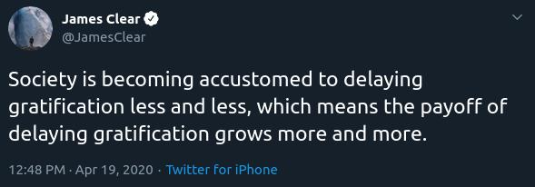
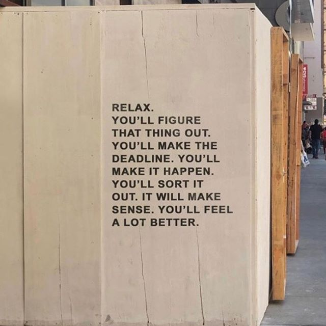
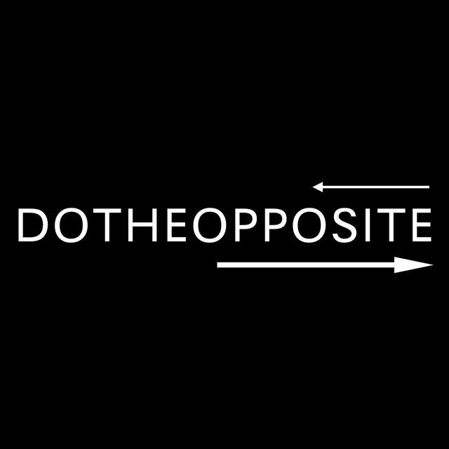

# Do the Opposite #60 - Ship No Matter What, Hindrances to Self-Mastery, 44 Possessions, Never Wait

Good News Everyone!

Welcome to the newest issue of the Do the Opposite newsletter, sent every Monday! If you like it, put a ring on it! Just kidding —> use this link  to subscribe and share it with your friends: [https://www.dotheoppo.site/newsletter](https://www.dotheoppo.site/newsletter) — this helps the newsletter grow! 🙌

If you want to share any resources, articles, books or anything else with the community, please [DM me on Twitter](https://twitter.com/ka11away) with your recommendations!
_________

## Weird Circumstances

This newsletter is coming to you in weird circumstances. TinyLetter, the platform that Do the Opposite has been based on so far, is experiencing issues with their Twitter Sign-On (which I've always used). I've reached out to them but so far have not received a response yet - I will monitor the situation.

I will find an alternative way to publish this particular issue of Do the Opposite - I am thinking of putting it on GitHub as a repo, or something similar. Once the issue is resolved, everyone will receive this DTO issue via email, as usual.

## Ship No Matter What

When I've learnt about the issue with the platform, my first thought was: "Maybe I should just skip a week", but then I reminded myself that consistency is paramount. I've been releasing a new issue of DTO every week for more than a year now and I don't want to let external circumstances dictate what I do. I will ship it no matter what :)

I've thought about moving the newsletter to another platform before (mainly so that I can do more in terms of format, design and more), because TinyLetter options for that are quite minimalist. It's not a bad thing but sometimes it's limiting me. I know of some alternatives but if you have a strong recommendation for a newsletter platform provider, please DM me on Twitter with your thoughts! Thanks in advance!

## Personal Update

I'm still meditating every day. My #100DaysOfMeditation challenge has definitely built up a strong habit for me. 

I am now thinking of doing #100DaysWithout Coffee since due to all this stress my gastritis has flared up. I've tried it recently but as soon as it got a bit better I went back to coffee which was a terrible idea :) I am also thinking of doing #100DaysOfPushups, where I will start with 15 pushups, and add 2 pushups every day for 100 days.

If you want to join me for either or both these challenges, *let's start them together this Friday, April 24*. I will announce it on Twitter as well. For pushups, you can define your own rules of course.

If you want to explore other #100DaysOfX challenges, [visit the official website](https://www.100daysofx.com) for the challenges.

I've finally managed to start writing blog posts again (see Tech Corner section below) and will work on my self-discipline to keep writing a post every week (topics will match those of this newsletter + some tech posts).

---

## Articles

1. ["Never Wait" by Derek Sivers](https://sivers.org/neverwait)

This story illustrates the "Never ask for permission, ask for forgiveness" advice. If you want to start something (a business, a project, etc) don't wait for others to OK it for you, just start. When the project grows, its own momentum will take care of all the external barriers as it moves forward.

2. ["The Way You Think About Willpower Is Hurting You" by Nir Eyal](https://getpocket.com/explore/item/the-way-you-think-about-willpower-is-hurting-you)

Nir tells us about the fascinating new research behind willpower. There's a common sense knowledge these days that willpower is a limited resource that we drain as we use it throughout the day. That was popularized by the research of Roy Baumeister in his book ["Willpower"](https://www.goodreads.com/book/show/11104933-willpower) which I read a while back and enjoyed a lot.

There is newer research that shows that willpower is limited only if you believe it's limited. Sort of a nocebo effect (the opposite of placebo). Also, they now compare willpower to an emotion like joy or sadness. You can't run out of an emotion and similarly can't run out of willpower. David Goggins was right all along :)

3. ["Drive-In Movie Theaters Thrive Despite Lack of New Titles: 'People Just Want to Get Out' " by Scott Roxborough](https://www.hollywoodreporter.com/news/drive-movie-theaters-thrive-lack-new-titles-people-just-want-get-1290659)

Bringing in some good news! Many businesses are affected by the COVID-19 crisis, but the popularity of drive-in movie theatres is on the rise. Your car provides the safety from the virus, while you can enjoy a relatively large event together with others.

---

## Tech Corner

1. If you're interested in learning Vim, Linux or tmux, [Jay LaCroix (aka Jay the Linux Guy)](https://twitter.com/JayTheLinuxGuy) has great video series on each of these topics. Also, check out his [YouTube channel](https://www.youtube.com/user/JtheLinuxguy) for other cool videos: laptop reviews, Linux distro reviews, and more. Here are the playlists:

- [Linux Commands for Beginners](https://www.youtube.com/playlist?list=PLT98CRl2KxKHaKA9-4_I38sLzK134p4GJ)
- [Vim Beginner's Guide](https://www.youtube.com/playlist?list=PLT98CRl2KxKHy4A5N70jMRYAROzzC2a6x)
- [Getting started with tmux](https://www.youtube.com/playlist?list=PLT98CRl2KxKHy4A5N70jMRYAROzzC2a6x)

2. This weekend I've written my first post in DEV community. If you are using Vim or interested in learning it, you'll find it helpful. 

[7 Vim Tips That Changed My Life (With Demo)](https://dev.to/ka11away/7-vim-tips-that-changed-my-life-with-demo-51hg)

---

## Videos

1. ["5 Hindrances to Self-Mastery" | Shi Heng Yi](https://www.youtube.com/watch?v=4-079YIasck)

Shi Heng Yi emanates serenity, calmness and clarity. It's amazing to watch him talk. The 5 hindrances he talks about can be thought of as different manifestations of Resistance - a force that blocks us from achieving our full potential, finding our true Self.

2. ["My 44 Possessions: Everything I Own Fits in My Backpack" | Rob Greenfield](https://www.youtube.com/watch?v=FqTkiLxIE9Y)

I exclaimed "What??" so many times when I watched this video that you could make a drinking game out of it. Rob only owns 44 possesions in the moment, which he himself admits is extreme. He got there slowly over time though - if you watch his other videos, he started with way more stuff living in an apartment and over the years have dialed up on the minimalism. 

I think of him as modern day [Diogenes](https://www.britannica.com/biography/Diogenes-Greek-philosopher), who teaches the humans around that they don't need all this fluff and stuff to be happy and tries to "shock us into sanity" with his extreme lifestyle. The thing is that with our society of endless consumption and immediate gratifications, we are not normal either. Most of us are on another pole from where Rob is. We can all meet in the middle, with learning to consume, pollute and destroy a little less.

3. ["bad guy (Billie Eilish) on 7 Electric Devices" | Device Orchestra](https://www.youtube.com/watch?v=8jDROj236R4)

This video is pure joy - watch it immediately and your mood will drastically improve no matter what it's like now :)

--- 

## [Tweet of the Week](https://twitter.com/JamesClear/status/1251915566786412550)

---

## Ethos

---

## Quotes

"The professional has learned that success, like happiness, comes as a by-product of work. The professional concentrates on the work and allows rewards to come or not come, whatever they like." 
― Steven Pressfield, "The War of Art: Break Through the Blocks & Win Your Inner Creative Battles"

"If you do follow your bliss you put yourself on a kind of track that has been there all the while, waiting for you, and the life that you ought to be living is the one you are living. Follow your bliss and don't be afraid, and doors will open where you didn't know they were going to be." 
― Joseph Campbell

"If you can see your path laid out in front of you step by step, you know it's not your path. Your own path you make with every step you take. That's why it's your path." 
― Joseph Campbell

_________

## Do the Opposite

### ZERNO

I am building an app ― sign up to get early access! [zerno.app](https://www.zerno.app)

### YOUTUBE

There's also a YouTube channel with weekly videos on the same themes that are covered in this newsletter. [Subscribe HERE](https://www.youtube.com/c/DoTheOpposite) and let the ideas influence you into an improved and happier life!

### TELEGRAM
 
Do the Opposite has a public Telegram channel. The content there is a little different than in the newsletter: faster to consume, a bit more random ― basically anything weird or interesting that catches my eye: articles, tweets, videos, images, etc. Hope to see you there as well! :) Here it is: [t.me/dotheopposite](http://t.me/dotheopposite)

### SHARING IS CARING

If you find this newsletter helpful, please consider forwarding this email to to your friends! Or just give them this link: [https://www.dotheoppo.site/newsletter](https://www.dotheoppo.site/newsletter)

___ 

Keep doing the opposite, 
Alex Kallaway

Website: [dotheoppo.site](http://dotheoppo.site) 
Twitter: [twitter.com/ka11away](http://twitter.com/ka11away)